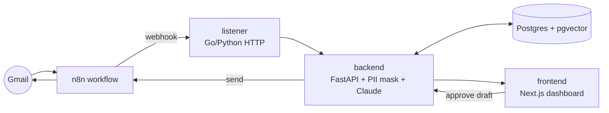

# AImail

AI-powered corporate email assistant. Reads full email threads, learns the user's writing style, generates context-aware reply drafts, and routes everything through PII masking before reaching the Claude API.

Final-year project (Monash University Malaysia, FIT3163) — Group MDS25, supervised by Dr. Asad Malik.

## Architecture

Four components:

| Folder       | Service   | Responsibility                                                       |
|--------------|-----------|----------------------------------------------------------------------|
| `n8n/`       | n8n       | Watches Gmail, fires webhook on new email; sends approved replies.   |
| `listener/`  | listener  | Tiny HTTP service that receives the webhook and forwards to backend. |
| `backend/`   | backend   | The brain — PII masking, Claude calls, agent pipeline, DB I/O, REST. |
| `frontend/`  | frontend  | Next.js dashboard. Talks to backend via REST only.                   |

Backend governs everything. Frontend only knows REST contracts.

## Tech stack

- Backend — Python, FastAPI
- Listener — Python initially, Go later (perf benchmark)
- Frontend — Next.js, React, TypeScript, Tailwind
- Database — PostgreSQL + pgvector
- Automation — n8n
- AI — Claude API (Anthropic)

See [`specs/context/tech-stack.md`](specs/context/tech-stack.md) for pinned versions and links.

## Run locally

Each service has its own README with run instructions. Most are placeholders right now:

- [`backend/README.md`](backend/README.md)
- [`frontend/README.md`](frontend/README.md)
- [`listener/README.md`](listener/README.md)
- [`n8n/README.md`](n8n/README.md)
- [`infra/README.md`](infra/README.md)

## Contributing

See [`CONTRIBUTING.md`](CONTRIBUTING.md) for branch naming, commit conventions, and the issue → spec → code workflow.

Specs live in [`specs/`](specs/). Every feature gets a spec file before code is written.

## License

TBD.
