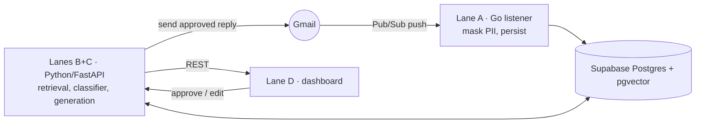

# AImail

AI-powered corporate email assistant. Ingests Gmail, masks PII, grounds replies in company
policy via RAG, drafts context-aware replies with a multi-agent pipeline, and surfaces them in a
dashboard for human approval.

Final-year project (Monash University Malaysia, FIT3163) — Group MDS25, supervised by Dr. Asad Malik.

## Architecture



See [`specs/architecture.md`](specs/architecture.md) for the full component + seam breakdown.

| Lane | Owner | Folder | Responsibility |
|------|-------|--------|----------------|
| A | JiaJun | `listener/` | Go: Gmail + Pub/Sub, PII masking, Supabase persistence + audit |
| B | Elyesa | `backend/app/rag`, `backend/app/ml` | RAG retrieval, priority classifier, eval |
| C | hanif | `backend/email_agent.py` | Reply generation (route → summarize → draft → critic) |
| D | Han | `frontend/` | Dashboard (Vite/React) |

## Tech stack

Python + FastAPI (backend), Go (listener), Vite/React/TypeScript (frontend), Supabase
(Postgres + pgvector), Gemini (embeddings, retrieval, and Lane C generation).
Pinned versions: [`specs/context/tech-stack.md`](specs/context/tech-stack.md).

## Running the stack

Server-side services share the root `.env` (copy from [`.env.example`](.env.example)); the
frontend keeps its own public env. Run each in its own terminal.

**First time — create the tables** (needs `DATABASE_URL`):
```bash
cd backend
../.venv/bin/python scripts/apply_migration.py app/db/migrations/0001_rag_tables.sql
../.venv/bin/python scripts/apply_migration.py app/db/migrations/0002_messages.sql
```

**The four services:**
```bash
make backend                                                  # Lane B/C API   :8000  (DATABASE_URL, GEMINI_API_KEY)
cd backend && uvicorn email_agent:app --reload --port 8001    # Lane C agent   :8001  (GOOGLE_API_KEY)
cd listener && go run .                                        # Lane A listener       (SUPABASE_*, Gmail/Pub-Sub)  (owner: JiaJun)
cd frontend/frontend/mail-clarity-dash-main && npm install && npm run dev   # Lane D dashboard :8080  (owner: Han)
```

**Key endpoints** (backend `:8000`):
- `GET /emails` — dashboard list (from `messages` + Lane B priority)
- `GET /emails/{id}` — one email + Lane C draft (calls the email agent on `:8001`)
- `POST /search`, `POST /ask` — Lane B retrieval / grounded answer

**Test the pipeline without the full Gmail setup.** The listener needs Gmail + Pub/Sub wiring; to
exercise everything downstream, insert a sample email directly:
```bash
cd backend
../.venv/bin/python scripts/seed_message.py    # inserts one message (as the listener would)
curl localhost:8000/emails                      # see it in the dashboard shape
curl localhost:8000/emails/<id-from-above>      # see it with a Lane C draft (email_agent on :8001)
```

Lane B helpers (repo root): `make eval`, `make ingest PDF=... TITLE=...`, `make check`.

## Contributing

Branch/PR flow and the spec-first workflow: [`CONTRIBUTING.md`](CONTRIBUTING.md) and
[`docs/git-workflow.md`](docs/git-workflow.md). Cross-lane contracts live in
[`backend/app/contracts.py`](backend/app/contracts.py) + [`specs/context/`](specs/context/) —
change the shape there first, then implement.

## Copyright

© 2026 Group MDS25, Monash University Malaysia. All rights reserved.
