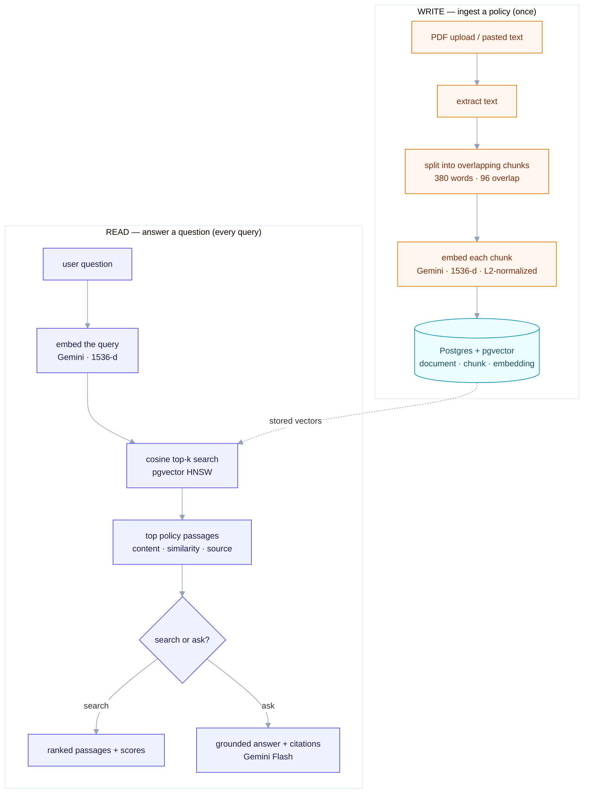

# RAG retrieval pipeline (Lane B)

How a company policy document becomes a searchable, answerable knowledge base — from upload
to grounded answer. Two paths share one vector store.

## The two paths

- **Write (once per document):** a policy is uploaded, its text is split into overlapping
  chunks, each chunk is embedded into a 1536-dimension vector, and the vectors are stored in
  pgvector. This builds the index.
- **Read (every query):** a question is embedded the same way, matched against the stored
  vectors by cosine similarity, and the closest passages are returned — or, on "ask", fed to
  an LLM to produce an answer grounded only in those passages.

The search never re-reads the PDF; it reads the stored vectors. Changing a policy means
re-uploading (same filename replaces, a new filename adds alongside).

`R` = retrieval (this lane). `G` = generation, shown via `/ask` — that is Lane C's job; the
`/ask` endpoint is a scoped demo of the full loop.
