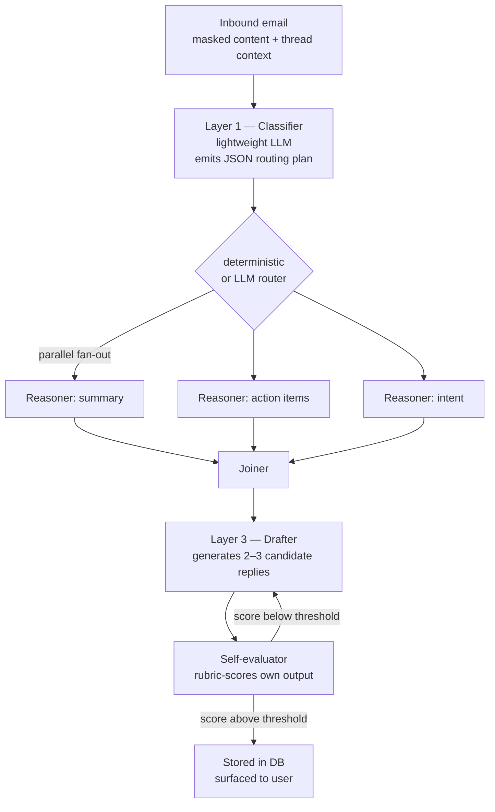

# Agent pipeline

How the backend turns an incoming email into a draft reply. Three layers, two feedback loops, persisted as a `chat` → `conversation` chain in Postgres.

This file is the **detailed view** of one bullet on [`architecture.md`](architecture.md). Read that first if you haven't.

---

## The three layers



### Layer 1 — Classifier

**Goal:** read the email, decide what's needed, emit a routing plan as JSON.

- **Input:** masked email body + recent thread context from the `chat` table.
- **Output (JSON):** which reasoners to run, whether they can run in parallel, which drafter tier to use, expected output language/tone.
- **Model tier:** lightweight (Gemma 3B–7B, GPT-5 Nano, or DeepSeek small). See [`context/tech-stack.md`](context/tech-stack.md).
- **Why JSON, not free text:** the backend code branches on this output. JSON is parseable; free text isn't.
- **Why a small model:** runs on every email; cost and latency dominate. Reasoning over a short email is the easiest LLM task that exists.

### Layer 2 — Reasoners (parallel)

**Goal:** extract the structured pieces the drafter needs.

- **Sub-tasks (independent → parallel):**
  - Summary of the email/thread.
  - Action items requested by the sender.
  - Intent (what does the sender actually want — confirmation, decision, info, scheduling, etc.).
- **Model tier:** mid (DeepSeek for reasoning, Claude Sonnet, or GPT-5).
- **Parallelism:** all three run concurrently. They don't depend on each other. Joining is a fan-in step in the orchestration framework.
- **Failure mode:** if one reasoner fails, the drafter still gets the others. We don't block on the slowest.

### Layer 3 — Drafter

**Goal:** produce 2–3 candidate replies for the user to pick from.

- **Model tier:** highest-quality (Claude Opus 4.7, Claude Sonnet, GPT-5, DeepSeek).
- **Inputs:** masked thread context + reasoner outputs + user's `style_profile` features.
- **Output:** N draft candidates (default N=3), each with a confidence score from the self-evaluator.
- **Why multiple drafts:** lets the user pick; the pick itself is preference data we store.

---

## The two loops

### Loop A — Self-evaluation (machine ↔ machine)

After the drafter produces a candidate, an evaluator pass scores it against a rubric (tone match, intent coverage, action-item completeness, no hallucinations). If the score is below threshold, the drafter regenerates with the rubric feedback included. Up to **3 iterations** per candidate before giving up and surfacing whatever we have.

**Why:** every Loop A iteration is invisible to the user but lifts quality dramatically. This is what big providers do behind a single API call — we just do it explicitly.

**Implementation note:** every iteration is a new row in `conversation` linked to the same `chat`. Don't overwrite — keep the trail for debugging.

### Loop B — User feedback (human ↔ machine)

The user is shown N drafts and:

1. **Picks one** (or rejects all).
2. **Edits it** before approving.
3. **Approves**, which sends it via n8n → Gmail.

What we capture in `draft_feedback`:

- Which draft index they picked.
- Diff between picked draft and edited final text.
- Optional thumbs up/down on the experience.

**How this trains us:** model selection at each tier becomes a multi-armed bandit. The "Drafter: Claude Opus" path that gets picked-and-shipped-without-edits the most becomes the default. New users start with the team-wide default; their own data biases their personal default after ~20 emails.

---

## Memory model — `chat` and `conversation`

These are defined in [`context/db-schema.md`](context/db-schema.md). The shape:

```
chat (1)         ─┬─ thread (1, FK)
                  ├─ conversation (N, child rows)
                  │      ├─ which layer (classifier / reasoner / drafter / evaluator)
                  │      ├─ model used
                  │      ├─ prompt + context sent
                  │      ├─ raw response
                  │      ├─ rubric score (for drafter rows)
                  │      └─ version label
                  └─ draft (N, surfaced to user)
                         └─ draft_feedback (1 per approved draft)
```

When a new email lands in an existing thread, the pipeline reads the most recent N `conversation` rows for that `chat` and includes them in the classifier's context. **This is the agent's "memory."**

---

## Why this shape, not alternatives

| Alternative | Why we didn't pick it |
|-------------|----------------------|
| One giant call to a single high-end model | No quality control loop; expensive on every email regardless of difficulty; can't learn which model wins at which tier. |
| Hard-coded routing (no classifier) | Would handle the 70% common case but degrade on edge cases the rules don't cover. The classifier costs <$0.001 per email and adapts. |
| Sequential reasoners | Triples latency for no quality gain — the three sub-tasks are genuinely independent. |
| Single draft (no candidate set) | Loses the user-pick signal that drives Loop B. Without that, model selection can't improve. |

---

## Open questions (decide before the first implementation spec)

- [ ] Where does the rubric live? Hard-coded in `backend/app/agents/rubric.py`, or per-user configurable?
- [ ] How many recent `conversation` rows go into context? (Token-budget vs. recall.)
- [ ] Where does PII masking sit relative to the pipeline? Before classifier? Per-layer?  *Default: once at ingress, un-mask once at egress.*
- [ ] Self-evaluator: same model as drafter (cheap, biased) or different model (expensive, less biased)?
- [ ] Latency budget: end-to-end target from ingestion to first draft? *Suggest 60s for sprint-1 demo.*

---

## Status

**Status:** draft — needs review by team before any implementation begins.
**Last updated:** 2026-04-29.
