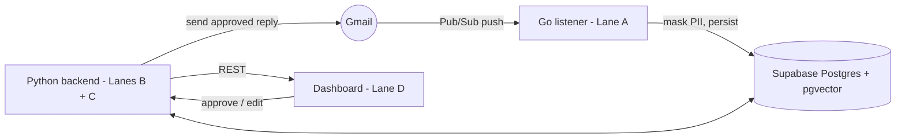

# AImail — Architecture & Cross-lane Sync

Living reference for how the lanes fit together and where their contracts meet. Updated at
integration sync (2026-08-06) from the actual branch state. Items marked **(to confirm)** are
team decisions, not settled facts.

## Lane ownership

| Lane | Owner | Branch | Builds |
|------|-------|--------|--------|
| A · Spine + privacy | JiaJun | `JiaJun` | Go listener: Gmail + Pub/Sub, PII masking, Supabase persistence + audit log |
| B · ML + retrieval | Elyesa | `feat/setup` | RAG (embed/store/retrieve), priority classifier, eval |
| C · Generation | hanif | `hanif` | `backend/email_agent.py` — reply generation |
| D · Surfaces | Han | `Han` | `frontend/mail-clarity-dash-main/` — Vite/React dashboard |

## Flow (as actually built)

n8n is not in the pipeline. Lane A ingests straight from the Gmail API + Pub/Sub, and outbound
send is the backend calling the Gmail API directly (reusing the listener's send-scoped token).
The `n8n/` folder is unused scaffolding.

## Components

- **listener/** (Lane A, Go): receives Gmail Pub/Sub notifications, pulls the message, **masks
  PII in the listener** (not the backend), and writes the masked row + an audit entry to Supabase
  via the PostgREST API (`SUPABASE_URL` + `SUPABASE_SERVICE_KEY`). Stateless.
- **backend/** (Lanes B + C, Python/FastAPI): reads masked email from Supabase (via `DATABASE_URL`
  / asyncpg), runs retrieval (B), the classifier (B), and generation (C, `email_agent.py`, on
  Gemini), caches + pre-generates drafts, exposes REST for the dashboard, and sends approved
  replies via the Gmail API.
- **frontend/** (Lane D): the dashboard that lists emails/drafts and takes approve/edit. Talks to
  the backend via REST only.

## Cross-lane seams & sync status

The contract lives in `backend/app/contracts.py` + `specs/context/{api-contracts,db-schema}.md`.
Change a shape there **first**, log it in `docs/decisions/shared.md`, then both sides implement.

| Seam | Producer → Consumer | Shape | Status |
|------|--------------------|-------|--------|
| **1 · masked email** | A → B, C | the persisted email row | resolved — `messages.body_masked` canonical (shared.md 2026-08-31) |
| **2 · retrieval context** | B → C | `ContextChunk` | defined (Lane B); confirm `email_agent` consumes it |
| **3 · priority** | B → D | `EmailPriority` | defined (Lane B); confirm dashboard type matches |
| **4 · drafts/emails REST** | C, B → D | REST responses | Han's dashboard has its own email types + mock data — must be reconciled with `api-contracts.md` |

## Reconciliation TODO (integration)

1. **Seam 1 field-name mismatch — resolved 2026-08-31.** `messages.body_masked` is canonical
   (`masked_body` retired); code was already unified and `db-schema.md` declares it. Decision
   recorded in `docs/decisions/shared.md`.
2. **One DB schema.** Lane A writes via Supabase PostgREST; Lane B reads via asyncpg — same
   Postgres, so the table/column names must be a single agreed contract in `db-schema.md` (A's
   email + audit tables, B's document/chunk/embedding + priority columns).
3. **One frontend (to confirm).** Han's Vite dashboard vs the Next.js scaffold in `frontend/`.
   Han's is the real one — retire the scaffold.
4. **One listener (to confirm).** JiaJun's Go listener vs the Python stub in `listener/`. Keep the
   Go one; retire the stub.
5. **Consolidate `.env.example`** with every lane's vars: `DATABASE_URL`, `GEMINI_API_KEY`,
   `SUPABASE_URL`, `SUPABASE_SERVICE_KEY`, `ANTHROPIC_API_KEY`, listener/Gmail vars.

## Governing principle

> The backend is the manager; the frontend is a visualisation layer.

- Frontend has no direct DB access, no model keys — REST to the backend only.
- Contract changes go into `api-contracts.md` / `db-schema.md` / `contracts.py` **first**, then
  both sides implement. Adding a field is safe; renaming/removing one is a breaking change — flag it.
