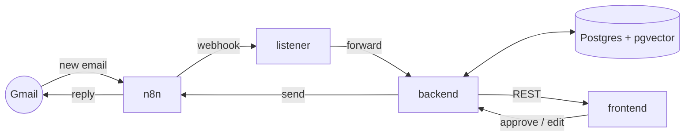

# AImail — Architecture

## Overview

AImail is split into four cooperating components. Each lives in its own top-level folder and is owned by a clear contract.

## Components

### 1. n8n — `n8n/`
Watches Gmail (inbound workflow) and sends approved replies (outbound workflow). Workflows are exported as JSON and version-controlled. n8n holds Gmail OAuth credentials; the repo never does.

### 2. listener — `listener/`
A small HTTP service that receives the n8n webhook on new email and forwards it to the backend with a shared-secret header. Python initially; planned Go rewrite for performance comparison. Stateless. Does not call Claude or touch the DB.

### 3. backend — `backend/`
Python + FastAPI. **The brain.** Responsibilities:

- PII masking (and un-masking on the way back).
- Multi-layer agent pipeline (classifier → reasoner(s) → drafter) with self-evaluation and user-feedback loops. Detailed in [`agent-pipeline.md`](agent-pipeline.md).
- Style-learning over the user's historical replies (pgvector embeddings).
- Postgres reads/writes — emails, threads, chats, drafts, style profiles.
- REST API for the frontend.
- Outbound calls to n8n to send approved replies.

### 4. frontend — `frontend/`
Next.js + TypeScript + Tailwind dashboard. Lists incoming threads, shows generated drafts, lets the user approve / edit / reject. Talks to the backend via REST only.

## Governing principle

> **The backend is the manager. It knows everything, controls everything. The frontend is a visualisation layer.**

- Frontend has no direct DB access, no Claude API key, no Gmail OAuth, no n8n awareness.
- Frontend talks to the backend via REST endpoints **only**. The endpoint signature is the contract; backend can change anything internally as long as the contract holds.
- **All LLM logic lives in the Python backend** — classification, routing, drafting, self-evaluation. Not in n8n. Not in the frontend.
- n8n's job is narrow: Gmail in (webhook on new mail), Gmail out (send approved replies). No conditional logic, no model calls.
- Contract changes are made in [`context/api-contracts.md`](context/api-contracts.md) **first**, then implemented on both sides.

## Data flow — happy path

1. New email arrives in Gmail.
2. n8n inbound workflow fires → POSTs to listener.
3. Listener authenticates the call and forwards to backend.
4. Backend persists the email, masks PII, runs the agent pipeline against Claude, stores the draft.
5. Frontend polls / subscribes to new drafts and renders them.
6. User approves (with optional edits).
7. Frontend POSTs approval to backend.
8. Backend un-masks PII, calls n8n outbound workflow to send via Gmail.

## Cross-cutting concerns

- **PII masking** is mandatory on every path that touches Claude. No raw email content leaves the backend without masking.
- **Secrets** never leave their owning service. The shared-secret between listener and backend is the only inter-service credential in the repo's surface area.
- **Observability** — structured logging in every service; correlation ID propagated from listener through to backend (TODO).
